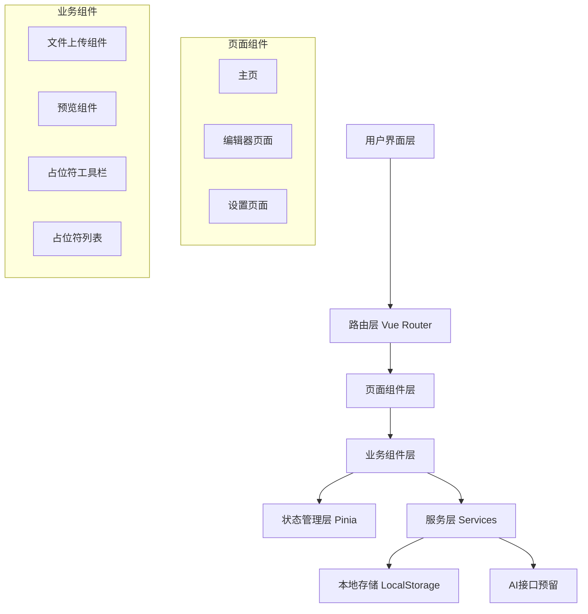

# 设计文档

## 概述

模板占位符编辑器是一个基于Vue 3 + TypeScript + Vite构建的单页应用（SPA）。系统采用组件化架构，使用Vue Router进行路由管理，Pinia进行状态管理。应用支持用户上传模板文件（文本、图片），在可视化编辑器中添加占位符标记，并为未来的AI填充功能预留扩展接口。

## 架构

### 技术栈

- **前端框架**: Vue 3 (Composition API)
- **语言**: TypeScript
- **构建工具**: Vite
- **路由**: Vue Router 4
- **状态管理**: Pinia
- **UI组件库**: Element Plus（可选，用于快速开发）
- **样式**: CSS3 / SCSS

### 系统架构图



### 目录结构

```
template-placeholder-editor/
├── public/
├── src/
│   ├── assets/              # 静态资源
│   ├── components/          # 可复用组件
│   │   ├── FileUploader.vue
│   │   ├── TemplatePreview.vue
│   │   ├── PlaceholderToolbar.vue
│   │   ├── PlaceholderList.vue
│   │   └── PlaceholderDialog.vue
│   ├── views/               # 页面组件
│   │   ├── Home.vue
│   │   ├── Editor.vue
│   │   └── Settings.vue
│   ├── stores/              # Pinia状态管理
│   │   ├── template.ts
│   │   └── placeholder.ts
│   ├── services/            # 业务逻辑服务
│   │   ├── fileService.ts
│   │   ├── storageService.ts
│   │   └── aiService.ts
│   ├── types/               # TypeScript类型定义
│   │   ├── template.ts
│   │   └── placeholder.ts
│   ├── router/              # 路由配置
│   │   └── index.ts
│   ├── utils/               # 工具函数
│   │   └── helpers.ts
│   ├── App.vue
│   └── main.ts
├── package.json
├── vite.config.ts
└── tsconfig.json
```

## 组件和接口

### 核心组件

#### 1. FileUploader 组件

**职责**: 处理文件上传和验证

**Props**:
```typescript
interface FileUploaderProps {
  acceptedTypes: string[];  // 支持的文件类型
  maxSize: number;          // 最大文件大小（MB）
}
```

**Events**:
```typescript
interface FileUploaderEvents {
  onFileSelected: (file: File) => void;
  onError: (error: string) => void;
}
```

#### 2. TemplatePreview 组件

**职责**: 渲染模板内容并支持占位符交互

**Props**:
```typescript
interface TemplatePreviewProps {
  content: string | ArrayBuffer;
  contentType: 'text' | 'image';
  placeholders: Placeholder[];
  scale: number;
}
```

**Events**:
```typescript
interface TemplatePreviewEvents {
  onTextSelect: (selection: TextSelection) => void;
  onPlaceholderClick: (placeholderId: string) => void;
}
```

#### 3. PlaceholderToolbar 组件

**职责**: 提供占位符操作工具

**Props**:
```typescript
interface PlaceholderToolbarProps {
  selectedText: string;
  canAddPlaceholder: boolean;
}
```

**Events**:
```typescript
interface PlaceholderToolbarEvents {
  onAddPlaceholder: () => void;
  onUndo: () => void;
  onRedo: () => void;
}
```

#### 4. PlaceholderList 组件

**职责**: 显示和管理占位符列表

**Props**:
```typescript
interface PlaceholderListProps {
  placeholders: Placeholder[];
  activePlaceholderId: string | null;
}
```

**Events**:
```typescript
interface PlaceholderListEvents {
  onSelect: (placeholderId: string) => void;
  onEdit: (placeholderId: string) => void;
  onDelete: (placeholderId: string) => void;
}
```

#### 5. PlaceholderDialog 组件

**职责**: 占位符配置对话框

**Props**:
```typescript
interface PlaceholderDialogProps {
  visible: boolean;
  placeholder: Placeholder | null;
  mode: 'create' | 'edit';
}
```

**Events**:
```typescript
interface PlaceholderDialogEvents {
  onConfirm: (placeholder: Placeholder) => void;
  onCancel: () => void;
}
```

## 数据模型

### Template 模板数据

```typescript
interface Template {
  id: string;
  name: string;
  file: File | null;
  content: string | ArrayBuffer;
  contentType: 'text' | 'image';
  createdAt: Date;
  updatedAt: Date;
}
```

### Placeholder 占位符数据

```typescript
interface Placeholder {
  id: string;
  name: string;
  description: string;
  position: PlaceholderPosition;
  aiPrompt?: string;        // AI填充提示词（预留）
  aiContext?: string;       // AI上下文信息（预留）
  value?: string;           // 填充后的值
  createdAt: Date;
}

interface PlaceholderPosition {
  startOffset: number;      // 文本起始位置
  endOffset: number;        // 文本结束位置
  x?: number;               // 图片X坐标（可选）
  y?: number;               // 图片Y坐标（可选）
  width?: number;           // 占位符宽度（可选）
  height?: number;          // 占位符高度（可选）
}
```

### Project 项目数据

```typescript
interface Project {
  id: string;
  name: string;
  template: Template;
  placeholders: Placeholder[];
  createdAt: Date;
  updatedAt: Date;
}
```

## 状态管理

### Template Store

```typescript
interface TemplateState {
  currentTemplate: Template | null;
  isLoading: boolean;
  error: string | null;
}

interface TemplateActions {
  uploadTemplate(file: File): Promise<void>;
  clearTemplate(): void;
  updateTemplate(template: Partial<Template>): void;
}
```

### Placeholder Store

```typescript
interface PlaceholderState {
  placeholders: Placeholder[];
  activePlaceholderId: string | null;
  history: PlaceholderHistory[];
  historyIndex: number;
}

interface PlaceholderActions {
  addPlaceholder(placeholder: Omit<Placeholder, 'id' | 'createdAt'>): void;
  updatePlaceholder(id: string, updates: Partial<Placeholder>): void;
  deletePlaceholder(id: string): void;
  setActivePlaceholder(id: string | null): void;
  undo(): void;
  redo(): void;
}
```

## 服务层设计

### FileService

```typescript
class FileService {
  // 验证文件类型和大小
  validateFile(file: File, options: ValidationOptions): ValidationResult;
  
  // 读取文件内容
  readFile(file: File): Promise<string | ArrayBuffer>;
  
  // 检测文件类型
  detectContentType(file: File): 'text' | 'image';
}
```

### StorageService

```typescript
class StorageService {
  // 保存项目到本地存储
  saveProject(project: Project): void;
  
  // 加载项目
  loadProject(projectId: string): Project | null;
  
  // 获取所有项目列表
  getAllProjects(): Project[];
  
  // 删除项目
  deleteProject(projectId: string): void;
  
  // 导出项目为JSON
  exportProject(projectId: string): string;
  
  // 导入项目
  importProject(jsonData: string): Project;
}
```

### AIService（预留接口）

```typescript
interface AIFillRequest {
  placeholderId: string;
  prompt: string;
  context: string;
  templateContent: string;
}

interface AIFillResponse {
  placeholderId: string;
  generatedContent: string;
  confidence: number;
}

class AIService {
  // AI填充占位符（预留接口）
  async fillPlaceholder(request: AIFillRequest): Promise<AIFillResponse>;
  
  // 批量填充占位符
  async fillMultiplePlaceholders(requests: AIFillRequest[]): Promise<AIFillResponse[]>;
  
  // 测试接口（返回模拟数据）
  async mockFill(request: AIFillRequest): Promise<AIFillResponse>;
}
```

## 路由设计

```typescript
const routes = [
  {
    path: '/',
    name: 'Home',
    component: Home,
    meta: { title: '主页' }
  },
  {
    path: '/editor',
    name: 'Editor',
    component: Editor,
    meta: { title: '编辑器' }
  },
  {
    path: '/editor/:projectId',
    name: 'EditorWithProject',
    component: Editor,
    meta: { title: '编辑器' }
  },
  {
    path: '/settings',
    name: 'Settings',
    component: Settings,
    meta: { title: '设置' }
  },
  {
    path: '/:pathMatch(.*)*',
    redirect: '/'
  }
];
```

## 错误处理

### 错误类型定义

```typescript
enum ErrorType {
  FILE_VALIDATION_ERROR = 'FILE_VALIDATION_ERROR',
  FILE_READ_ERROR = 'FILE_READ_ERROR',
  STORAGE_ERROR = 'STORAGE_ERROR',
  AI_SERVICE_ERROR = 'AI_SERVICE_ERROR',
  UNKNOWN_ERROR = 'UNKNOWN_ERROR'
}

interface AppError {
  type: ErrorType;
  message: string;
  details?: any;
}
```

### 错误处理策略

1. **文件上传错误**: 在FileUploader组件中捕获，显示用户友好的错误提示
2. **存储错误**: 在StorageService中捕获，提供降级方案（内存存储）
3. **AI服务错误**: 在AIService中捕获，返回错误状态并允许用户重试
4. **全局错误**: 使用Vue的errorHandler捕获未处理的错误，记录日志

### 错误提示UI

- 使用Toast通知显示非阻塞性错误
- 使用Modal对话框显示需要用户确认的错误
- 在组件内部显示内联错误信息

## 测试策略

### 单元测试

- **组件测试**: 使用Vitest + Vue Test Utils测试各个组件的功能
- **Store测试**: 测试Pinia store的actions和getters
- **Service测试**: 测试服务层的业务逻辑

### 集成测试

- 测试文件上传到预览的完整流程
- 测试占位符添加、编辑、删除的完整流程
- 测试项目保存和加载的完整流程

### E2E测试（可选）

- 使用Playwright或Cypress测试关键用户流程

### 测试覆盖目标

- 核心业务逻辑: 80%以上
- 组件: 70%以上
- 服务层: 90%以上

## 性能优化

### 优化策略

1. **懒加载**: 路由组件使用动态导入
2. **虚拟滚动**: 占位符列表超过100项时使用虚拟滚动
3. **防抖**: 预览更新使用500ms防抖
4. **缓存**: 文件内容读取后缓存到内存
5. **代码分割**: 使用Vite的代码分割功能

### 性能指标

- 首屏加载时间: < 2秒
- 文件上传响应: < 500ms
- 预览更新延迟: < 500ms
- 占位符操作响应: < 100ms

## 安全考虑

1. **文件验证**: 严格验证上传文件的类型和大小
2. **XSS防护**: 对用户输入进行转义，使用Vue的v-text而非v-html
3. **本地存储**: 敏感数据不存储在LocalStorage
4. **AI接口**: 未来集成时需要实现API密钥管理和请求签名

## 扩展性设计

### AI功能扩展点

1. **占位符数据结构**: 已预留aiPrompt和aiContext字段
2. **AIService接口**: 定义了标准的请求/响应格式
3. **批量处理**: 支持一次性填充多个占位符
4. **结果验证**: 预留confidence字段用于AI生成内容的置信度评估

### 未来功能扩展

1. **多模板支持**: 支持同时编辑多个模板
2. **协作功能**: 支持多人协作编辑
3. **模板市场**: 提供模板分享和下载功能
4. **高级编辑**: 支持富文本编辑和样式定制
